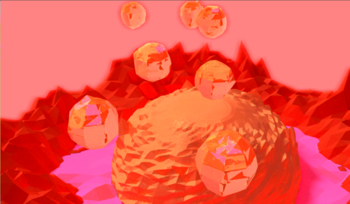
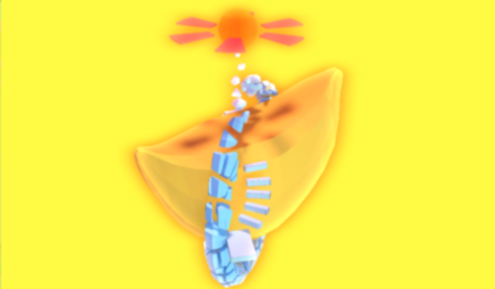
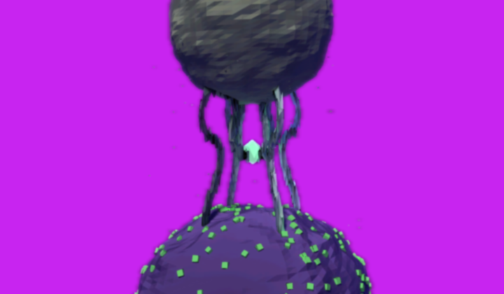
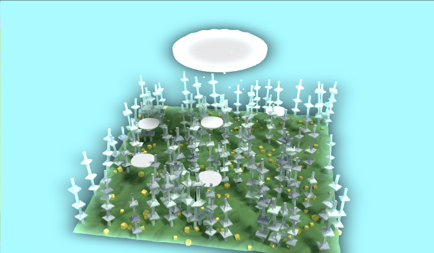

# K4G

一款名为《KK的四幅画》的开源游戏，跨平台支持 Android、Linux、Mac OS、Windows。

## 游戏场景概览

#### 场景一、炎球山陨石坑

炎球山陨石坑，坑中的球形山体会不定期释放出一种比周边空气更轻的球状凝胶物质，由于这种球状凝胶物质稳定性和密封性很好且密度非常底，所以目前有些科学家正在研究如何利用它来在星球间传送物资。

#### 场景二、肥蕉岛人造小行星

肥蕉岛人造小行星，宇宙各星球人民联合推出的项目，能够方便各大星球的宇航船及时补充能源和物资，是一种半自助式的小型太空救援站。

#### 场景三、奇异树双星系统

奇异树是一种被宇宙人类过度砍伐而濒临灭绝的宇宙植被，虽然这种植被的生命力极强但目前全宇宙已知的奇异树也仅剩下了一棵。而这棵奇异树由于某种原因飘落在了一个原本稳定的双星系统中，并被引力拉扯为两半，分别落在这两颗星球上。或许是机缘巧合，在某一个宇宙年中原本奇异树被分开的两部分由于双星的运动规律改变而被意外拼接到了一起，而这时拥有强大生命力的奇异树也瞬间复活了。复活的奇异树开出了硕大的宝石般的果子，并从果子当中释放出一种特殊的射线。而这种射线会影响人类的大脑，被影响的人会在潜意识当中不自觉的将过去和未来发生的美好的事情与奇异树相关联。所以虽然奇异树复活、结果的时间非常短暂，但当事人却会有一种仿佛在奇异树附近拥有过很长一段美好生活的错觉，这也许就是很多情侣会来到这里旅游的原因吧。

#### 场景四、非生物自适应太空田

由宇宙高级文明使用引力干涉自适应生成技术创建的非生物太空田，虽然大部分科学家都认可这片太空田当中的物体都是非生物，但对于这片太空田整体是否属于生物目前学术界还没有比较统一的说法。